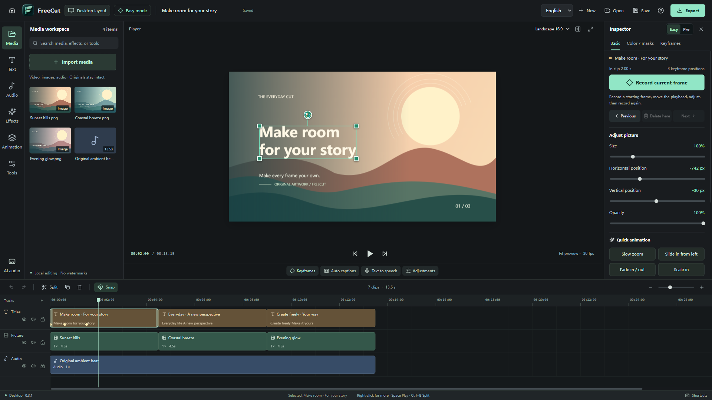
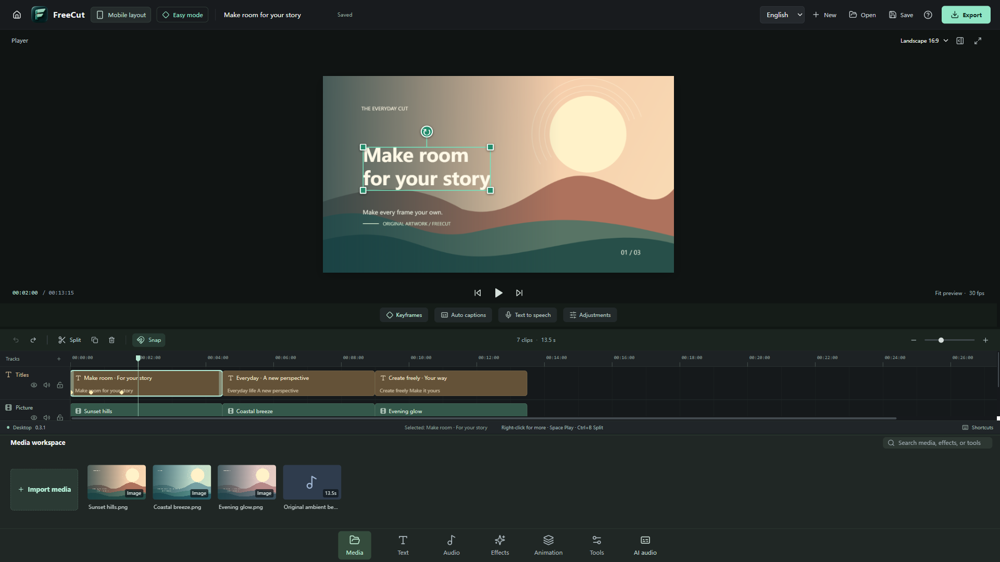

<p align="center">
  
</p>

<h1 align="center">FreeCut</h1>

<p align="center">An open-source desktop video editor. Make it yours.</p>

<p align="center"><a href="README.md">简体中文</a> | <strong>English</strong></p>

FreeCut is a video editor for Windows and macOS, built by middle-school student **@我叫水管同学** using **GPT-6 and Codex**. Its Chinese name is 水管剪辑; its English name remains FreeCut. The interface defaults to Simplified Chinese, with English available in Settings.

**All features are free forever. No memberships, no paid unlocks, and no export watermark.** No account is required. Media processing happens locally; updates and optional model downloads need an internet connection.

The current source version is the **0.3.2 development preview**, focused on Windows shortcut and stale-icon fixes after upgrades. Check its Release page for publication status. It does not yet cover every feature of Jianying or CapCut. The project aims to make everyday editing, desktop keyframes, captions, and local voice tools easier to reach. See the [feature matrix](docs/FEATURE-MATRIX.md) and [verification record](docs/VERIFICATION.md) for the implemented scope and actual tests; these documents are currently in Chinese.

In the previous 0.3.1 release, both interface languages, context-menu editing, save/quit protection and legacy installation upgrades passed their checks. Its [three-platform build](https://github.com/Watertube-bilibili/freecut-desktop/actions/runs/34135596130) and [verified release workflow](https://github.com/Watertube-bilibili/freecut-desktop/actions/runs/34136544194) both succeeded. Refer to the 0.3.2 Release for this patch's verification and downloads.

The 0.3.2 installer updates verified old FreeCut desktop and Start menu shortcuts, including when the install location changes. A separate icon file and Windows refresh notification address stale icons after upgrades. Fresh installations use the same new icon. User-customized shortcuts are preserved.

## Preview





The second layout runs in the same desktop application. It is not an Android or iOS app.

[Watch or download the English promo](https://github.com/Watertube-bilibili/freecut-desktop/releases/download/v0.3.1-preview.1/freecut-launch-en-1080p.mp4): 55 seconds, 1080p, exported through the actual FreeCut application and verified completely silent. It credits `@我叫水管同学` and asks viewers to download and Star the repository. Add your own music if you wish. See the [actual product export and silence verification](videos/freecut-launch-en-edit/QA.md), separate from the [English visual source](videos/freecut-launch-en).

[Download the English editing kit](https://github.com/Watertube-bilibili/freecut-desktop/releases/download/v0.3.1-preview.1/freecut-launch-en-editing-kit.zip) for the genuine `.freecut` project, visual input, reproducible recipe, English instructions and licenses. On another computer, relink the project's one missing asset to `media/visual-source.mp4` inside the kit.

## Editing features

- Import local video, images, and audio. Arrange multiple tracks, layer picture-in-picture content, snap clips, trim, split, duplicate, and undo or redo edits.
- Use context menus on timeline clips, tracks, empty timeline space, and the preview to find actions for the current selection.
- Animate X/Y position, uniform scale, rotation, opacity, and volume. Keyframes use linear, ease-in, ease-out, ease-in-out, or hold interpolation. Splitting a clip preserves its animated motion.
- Select objects directly in the preview, drag them, resize with corner handles, and rotate. A complete drag gesture is one undo step.
- Start in Easy mode to capture a group of visual keyframes with one action. Switch to Pro mode for exact values and easing controls.
- Add editable text and captions, with font size, color, background, and outline controls. Import and export SRT files.
- Apply 19 original color presets, blur, pixelation, vignette, mirroring, or green/blue chroma key. Seven geometric masks support position, rotation, feathering, and inversion.
- Preview and add 16 original sound effects. Adjust stereo balance, independent channel gains, left-only/right-only routing, mono, and channel swapping. Preview and export use the same channel routing.
- Set a constant playback speed, clip volume, and visual or audio fades. Animation presets create keyframes that remain editable.
- Work in landscape, portrait, or square formats. Export H.264/AAC MP4 at the available 720p, 1080p, or 4K settings and 24–60 fps.
- Save and reopen `.freecut` projects. Projects reference your original media files; they do not embed or duplicate those media files.
- Find recent projects on the home screen, with search and sorting. Settings and recent-project records persist across launches.
- Keep unsaved work protected when closing, going home, or opening another project. Cancelling a save or encountering a save error leaves the current project open.
- Scrub quickly while the preview prioritizes the latest requested frame. Switching layouts preserves the currently displayed image while the next frame is prepared.
- Download optional open-source environments and models for automatic captions, Chinese text-to-speech, and ChatTTS. After installation, inference runs locally without uploading your media.
- Install through an original Windows setup interface, with C:, D:, or a custom location. The app can check this repository's Releases, verify downloads, and prepare updates while protecting unsaved work.

## Download and install

[Check the 0.3.2 preview Release](https://github.com/Watertube-bilibili/freecut-desktop/releases/tag/v0.3.2-preview.1). The table below lists this version's filenames; downloads are available only after the assets appear on that Release. The previously published [0.3.1 preview](https://github.com/Watertube-bilibili/freecut-desktop/releases/tag/v0.3.1-preview.1) remains available. Release packages include Windows setup and portable builds, macOS Intel and Apple Silicon DMG/ZIP builds, corresponding source archives, English and Chinese guides, and SHA-256 checksums. One application package supports both languages and starts in Simplified Chinese.

| Computer or use | Download | How to use it |
| --- | --- | --- |
| Windows 10/11 x64, regular installation | `FreeCut-0.3.2-win-x64-Setup.exe` | Choose your drive or folder; C: is not preselected. Upgrades repair eligible old shortcuts and their icons. |
| Windows 10/11 x64, no installation | `FreeCut-0.3.2-win-x64-Portable.exe` | Run from a writable folder. Keep the adjacent `FreeCutData` folder when moving the app; it stores settings, recent projects, and models. |
| Mac with Apple Silicon | `FreeCut-0.3.2-mac-arm64.dmg` | Open the DMG and drag FreeCut into Applications. |
| Mac with an Intel processor | `FreeCut-0.3.2-mac-x64.dmg` | Install the same way. |
| Mac, ZIP format preferred | `FreeCut-0.3.2-mac-arm64.zip` or `FreeCut-0.3.2-mac-x64.zip` | Extract the app for your processor. DMG and ZIP contain the same application; choose one. |

You need only one application download for normal use; the source archives are for developers and license compliance. On macOS, **Apple menu → About This Mac** identifies your processor.

Windows builds are unsigned. Mac builds use ad-hoc signing and are not yet signed with a Developer ID or notarized by Apple. Each Release identifies its source commit and platform build records. The publishing workflow checks the application artifacts, matching source, and uploaded file hashes.

You can upgrade a verified legacy FreeCut installation, including 0.2.0, in its existing directory without uninstalling first. The installer checks the old application's identity and replaces only incoming program paths, preserving projects, models and unrelated files. Unknown programs are not overwritten. Missing parent and installation folders are created automatically. After upgrading, use the new uninstaller; do not run a preserved legacy uninstaller against the new directory. On macOS, place the app in a writable location such as Applications before updating; updating from inside a read-only DMG is not supported.

For a stale Windows desktop icon, upgrade using the **Setup installer**. Version 0.3.2 gives shortcuts a separate ICO file named by its SHA-256 content hash and sends Windows Shell an update notification. Clearing the entire system icon cache is unnecessary. The installer replaces only shortcuts confirmed to belong to FreeCut without user customizations. Portable builds do not change desktop shortcuts.

## Start editing

1. FreeCut starts in Simplified Chinese. On the home screen, open **设置 → 简体中文 Language** and select **English**, then choose **New project**. You can also use the language selector at the top of the editor. The choice persists across restarts.
2. Import local media and add it to the timeline. Drag clips into position, or use their context menus to find editing actions.
3. Select a clip to adjust its properties. Use Easy mode for one-click keyframe snapshots, or Pro mode for precise control.
4. Save the project, then export an MP4. Keep the original media files alongside your work. If you move them, use **Relink media** to locate them again.

Read the detailed [English quick-start guide](docs/QUICKSTART.en.md). Published Releases also include this guide as `FreeCut-Quickstart-en.md`.

## Optional local AI

Models are not bundled in the installer. Open the caption or voice tools, choose a model, and use the download action. The interface shows size, licensing, progress, cancellation, and retry controls. First use needs network access and sufficient disk space; CPU inference can be slow.

Model capabilities and licenses are separate from the application's free feature policy. **ChatTTS model weights use CC BY-NC 4.0 and are for non-commercial use only.** Open-source code does not grant unrestricted commercial rights to model weights. See the [model documentation](docs/AI-MODELS.md) and [ChatTTS documentation](docs/CHAT-TTS.md) for download details and the exact tested configurations. These documents are currently in Chinese.

## Let an AI edit through FreeCut

The free [shuiguan-cut Skill](skills/shuiguan-cut/SKILL.md) turns local media and a JSON editing recipe into a genuine `.freecut` project and an MP4 exported by the actual FreeCut application.

It launches an isolated application instance and uses the real import, project, Canvas, and FFmpeg paths. It does not replace the final export with another editor. The recipe bridge currently covers cuts, layered text and shapes, basic transforms and keyframes, constant speed, fades, volume, and stereo routing. Its scope is narrower than the full application.

See [AI editing setup](docs/AI-EDITING.md) and the [recipe reference](skills/shuiguan-cut/references/recipe.md). The Skill requires a compatible FreeCut source checkout and local dependencies; it does not bundle runtimes or models. Its output directory must be new, so existing output is not overwritten.

## Development

Use Node.js **22.12 or later** and npm on Windows x64 or macOS. Install from the lockfile. Some npm configurations require the binary download scripts to be run separately:

```sh
npm ci
node node_modules/electron/install.js
node node_modules/ffmpeg-static/install.js
npm run prepare:ffmpeg
npm run dev:desktop
```

Build the interface and run the tests:

```sh
npm run build
npm test
node scripts/smoke-desktop.cjs
node scripts/regression-editor.cjs
node scripts/regression-context-menu.cjs
node scripts/regression-language.cjs
node scripts/regression-preview.cjs
node scripts/regression-home.cjs
node scripts/regression-keyframes.cjs
node scripts/regression-transform.cjs
node scripts/regression-effects.cjs
node scripts/regression-audio.cjs
node scripts/regression-update.cjs
node scripts/regression-entry-url.cjs
# Windows custom installer interface
node installer/smoke.cjs
```

The desktop smoke test generates original local media and exercises the actual Electron app: layouts, import, keyframes, text, project save/reopen, and MP4 export. Results go into the ignored `artifacts/smoke/` directory. Tests use isolated profiles and test-owned file-dialog choices; they do not edit your existing projects.

Regression coverage includes save/close protection, real video seeks, keyframe controls, preview transforms, mask pixels, short-window scrolling, stereo preview/export, and update cancellation or failure. These tests establish the behavior of their tested fixtures, not the quality of every possible media file or model output.

Release 0.3.1 was built from `bc68dc5`. Windows x64, macOS Intel and Apple Silicon passed the regressions and packaged-app media checks in the [matching CI run](https://github.com/Watertube-bilibili/freecut-desktop/actions/runs/34135596130). These results cover the tested fixtures, not every hardware configuration, recording or long project.

`npm run test:desktop` runs the build and desktop regressions. Real AI smoke tests disable downloads by default; the model documents explain how to explicitly prepare their dependencies.

For browser-only UI development, use `npm run dev`. Preview editing is available in the browser, but local models, complete project-media reopening, and FFmpeg video export require the desktop app.

Package locally:

```sh
npm run package:win
# Run on a Mac
npm run package:mac
```

Distributing the video engine also requires its corresponding source. CI uses the repository's pinned source-build process; quick local development uses the vendor's `ffmpeg-static` binaries. These are distinct sources. See [third-party notices](THIRD_PARTY_NOTICES.md) and the build scripts.

## Current limits

- This is a desktop application. The mobile-style layout is not an Android or iOS build.
- Canvas frame composition and FFmpeg encoding can take time and temporary disk space for long or 4K projects. Proxy media and a GPU rendering pipeline are not implemented yet.
- Preview decoding depends on formats supported by Electron. Common H.264 MP4, PNG/JPEG, WAV, and MP3 files are a practical starting point; some professional formats need transcoding.
- Speech recognition depends on language, recording quality, and model choice. Generated captions remain editable and are not guaranteed to be accurate.
- Model downloads and inference depend on network access, storage, and hardware. The documentation describes the actual tested scope; macOS model inference still needs validation on the corresponding devices.
- Curved speed ramps, reverse playback, pen masks, tracking, multicamera editing, multiple timelines, advanced AI cutout, video generation, and cloud collaboration are not complete.

## Architecture and licenses

FreeCut uses React, TypeScript, and Electron. Preview and video-frame export share the Canvas compositor and keyframe calculations; FFmpeg mixes audio from the same project model. Desktop IPC authenticates the application window and its main frame. Local media access is granted to files selected by the user or explicitly referenced by an opened project. See the [architecture document](docs/ARCHITECTURE.md).

Project code is **GPL-3.0-or-later**; see [LICENSE](LICENSE). Third-party libraries, the video engine, fonts, and models retain their own licenses, listed in [THIRD_PARTY_NOTICES.md](THIRD_PARTY_NOTICES.md). The original icon and brand are documented in [BRAND.md](docs/BRAND.md).

Try the preview, report reproducible issues, and contribute improvements. **[Star FreeCut on GitHub](https://github.com/Watertube-bilibili/freecut-desktop)** to follow its progress.
