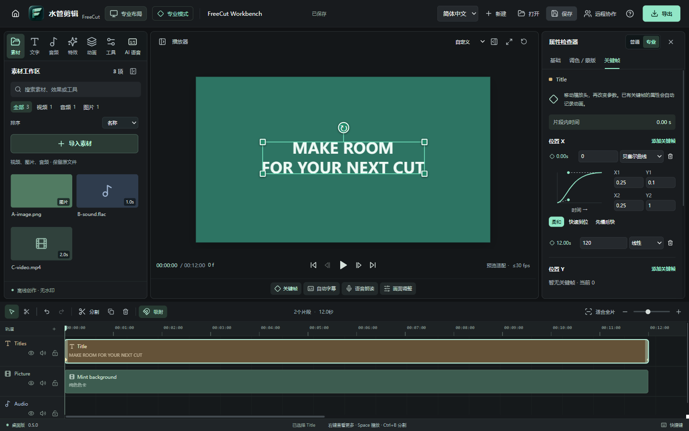
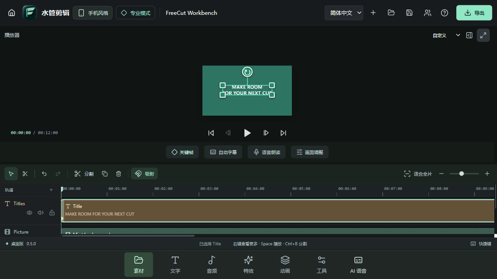

<p align="center">
  
</p>

<h1 align="center">水管剪辑 · FreeCut</h1>

<p align="center">开源桌面视频剪辑，让创作自由一点。</p>

<p align="center"><strong>简体中文</strong> | <a href="README.en.md">English</a></p>

**中文名：水管剪辑。英文名：FreeCut。界面默认简体中文，也可在设置中切换为 English。**

我叫水管同学出品。由初中生自主使用 GPT-6 与 Codex 制作的中文开源桌面视频编辑器。支持 Windows 和 macOS，面向日常剪辑、电脑端关键帧和容易找到的字幕 / 语音工具。

**全部功能永久免费，不设会员，不设付费解锁，无水印导出。** [爱发电支持作者](https://afdian.com/a/watertube)只是自愿赞助，是否赞助都能使用全部功能。

**当前源码为 0.5.0，正在验证，尚未发布安装包。下载区仍提供已发布的 0.4.2。** 这次基于 [Concat（原 WolfCut）](https://github.com/jub0t/Concat) 的部分算法与交互重构工作台和导出：可调面板、媒体分类、时间线适配、逐帧查看，新增贝塞尔关键帧；符合条件的多层画面走 FFmpeg 原生合成，文字和图形可在导出前生成一次透明图片后参与合成。保留水管剪辑的双布局、普通 / 专业模式、语音工具、模型目录、异地协作和旧工程兼容。确切代码来源、许可与未引入的组件见 [WolfCut 集成说明](docs/WOLFCUT-INTEGRATION.md)。这不是完整 Rust 引擎替换，也没有新增 GPU 编码；新版本结果以完成后的实际测试为准。

当前已发布 **0.4.2 预览版**，新增自定义朗读模型下载目录。在“AI 语音 → 语音朗读”选择父目录后，软件自动创建 `FreeCut-VoiceModels` 子目录，用于 ChatTTS、轻量 AISHELL 中文朗读模型及其模型缓存。发布和安装包状态见 [Release](https://github.com/Watertube-bilibili/freecut-desktop/releases/tag/v0.4.2-preview.1)，本次验证单独记录在 [0.4.2 验证记录](docs/VERIFICATION-042.md)。软件并未完整覆盖剪映。无账户要求；单人媒体处理在本地，开启协作后工程和素材会传给房间成员。

历史 0.4.1 已通过本机双桌面应用协作、Windows 与异地 Linux 机器之间的真实加密工程/素材传输，以及 Windows 打包程序中的原生传输检查；窄窗口工具栏自动收紧文字。具体样本、时间、发行状态和适用范围见 [0.4.1 验证记录](docs/VERIFICATION-041.md)及[跨网测试摘要](docs/verification/041-internet.json)，这些结果不等同于 0.4.2 已重新完成跨网测试。旧版安装图标与导出改造记录保留在 [0.3.2 验证记录](docs/VERIFICATION-032.md)。

切换朗读模型目录时，已完整安装的模型先复制、校验，成功后才启用新位置，源文件保留；失败则继续使用原目录。旧下载缓存和未完成文件保留原位，不参与迁移，后续朗读模型下载缓存使用新位置。下载或生成期间不能切换，可恢复默认，并记住下次启动的选择。Python、sherpa 运行环境、生成的音频，以及 SenseVoice / Whisper 自动字幕模型仍在原位置；自定义的是朗读模型和后续模型缓存，不能把整个应用的数据目录一起搬走。详见[模型目录说明](docs/AI-MODELS.md#自定义朗读模型目录)。

预览播放现在使用连续解码，拖动时合并待处理请求，不再反复取消尚未完成的画面；暂停后仍精确定位，导出保持独立逐帧渲染。“远程协作”默认使用异地邀请码：一台电脑创建房间，另一台粘贴邀请码，软件通过公开发现节点寻找对方并尝试 NAT 穿透，使用加密点对点连接自动传输素材和编辑。不需要注册账户、自建服务器或另装 VPN；房主需持续在线。部分受限网络不能直连，当前不提供媒体流量中继，不能保证所有网络都可连接。高级选项保留旧的 IP＋端口局域网方式。操作、隐私和容量限制见 [协作说明](docs/COLLABORATION.md)。

0.3.2 安装器会更新已核实归属的旧版 FreeCut 桌面和开始菜单入口，安装位置改变也能迁移；使用独立图标文件并通知 Windows 刷新，解决升级后仍显示旧图标的问题。首次安装同样创建新图标，用户自行修改过的快捷方式会保留。

导出会自动选择合适的处理路径。已发布的 0.4.2 支持常规裁剪、拼接、图片和变速的 FFmpeg 原生路径；0.5.0 源码将该路径扩展到符合条件的多层叠加、静态变换、位置动画及预先栅格化的文字 / 图形。超出原生支持范围的效果、动态缩放或旋转等仍使用预览共用的合成器，将 RGBA 画面直接送入编码器，边渲染边编码；不会忽略不支持的效果，也不会逐帧生成临时 PNG。实际提速取决于工程与设备；[0.3.2 验证记录](docs/VERIFICATION-032.md)中的旧测试不是 0.5.0 的性能数据。

带专辑封面的 FLAC 等音频现在按音频导入，不再把封面当成视频。重新打开旧工程时，会重新读取可用的相关素材并修正原先误识别的类型，保留片段位置、时长和音量动画。

新版采用原创 3D 图标，以“水管剪辑”为中文主名称。FreeCut 保留为英文名，仓库名、安装文件名和 `.freecut` 工程格式继续兼容。品牌来源与发布前排查见 [品牌说明](docs/BRAND.md) 和 [来源及许可核查](docs/RELEASE-REVIEW-030.md)。

操作步骤见 [中文使用说明](docs/QUICKSTART.md)，本次本机工作台和导出测试范围见 [0.5.0 验证记录](docs/VERIFICATION-050.md)；历史功能验证保留在 [验证记录](docs/VERIFICATION.md)。

自动更新默认开启：每次启动约 12 秒后检查本仓库 Release，发现新版自动下载和校验；运行期间每 4 小时再检查。下载就绪后在空闲时倒计时安装，未保存工程仍会提示保存。若异地组件缺失，界面提示重新安装，普通单人剪辑仍可启动。

让 AI 使用本软件剪片：安装免费的 [shuiguan-cut Skill](docs/AI-EDITING.md)，从本地素材生成可继续编辑的工程，并通过真实应用导出 MP4。

英文宣传片已通过真实 FreeCut 导出并发布：55 秒、1080p、全静音，保留 `@我叫水管同学` 署名，只引导下载和 GitHub Star。[观看 / 下载英文宣传片](https://github.com/Watertube-bilibili/freecut-desktop/releases/download/v0.3.1-preview.1/freecut-launch-en-1080p.mp4)，可以自行加音乐。[真实导出与静音检查](videos/freecut-launch-en-edit/QA.md)和[英文视觉源](videos/freecut-launch-en)分别记录。

[下载英文宣传片工程包](https://github.com/Watertube-bilibili/freecut-desktop/releases/download/v0.3.1-preview.1/freecut-launch-en-editing-kit.zip)：包含真实 `.freecut` 工程、视觉素材、可复现配方、英文说明及许可。换电脑打开工程时，将唯一缺失素材重新链接到包内的 `media/visual-source.mp4`。





以上为 2026-09-19 真实运行的 0.5.0 源码截图：中文桌面 1440×900、手机风格 1100×620。工作台 7 项回归均通过，见[工作台证据](docs/verification/050-workbench.json)；安装包仍待发布，下载区暂为 0.4.2。

## 可以做什么

本节描述当前 0.5.0 源码；新增工作台、贝塞尔和扩展原生合成尚未包含在下方的 0.4.2 安装包中。

- 工作台面板可调整，素材按类型筛选；时间线提供适配全部片段与分组工具，预览可逐帧查看。
- 导入本地视频、图片、音频；多轨编排、叠加画中画、吸附、修剪、分割、复制、撤销 / 重做。
- 时间线片段、轨道、空白区域和预览画面支持右键菜单，按当前位置提供剪辑操作。
- 默认简体中文；首页设置或编辑器顶部可切换 English，并跨次启动记住选择。工程中的用户文字和文件名不自动翻译。
- 为位置 X/Y、缩放、旋转、不透明度、音量添加关键帧，支持线性、缓入、缓出、缓入缓出、保持，以及 0.5.0 新增的贝塞尔曲线。分割保留动画变化，旧工程原有缓动规则不变。
- 在预览中直接点选、拖动、用角点缩放和旋转；一次拖动对应一次撤销。普通模式一键记录画面，专业模式可继续精确编辑。
- 添加文字和字幕，编辑字体大小、颜色、底色、描边；导入 / 导出 SRT。
- 19 种原创调色预设，另有模糊、像素化、暗角、镜像与绿/蓝幕抠像；7 种几何蒙版，支持位置、旋转、羽化与反转。
- 内置 16 种原创音效，直接试听并加入时间线；支持左右声道音量、平衡、仅左/仅右、单声道和左右交换，预览与导出采用一致路由。
- 常规变速、音量、画面与音频淡入淡出；动画预设生成可继续编辑的关键帧。
- 横屏、竖屏、方形画布；H.264 + AAC 的 MP4 导出，720p / 1080p / 1440p / 4K，24–60 fps。
- 自动为符合条件的常规剪辑、多层叠加和位置动画选择 FFmpeg 原生导出；可用的文字 / 图形只准备一次透明图片。其余复杂画面通过 RGBA 管道持续送帧，不逐帧写入临时 PNG 文件。
- 工程保存与重开，保留源文件引用；素材不复制进工程文件。
- 启动首页：我的项目、搜索与排序、设置、关于；最近工程跨次启动保留，关于页可打开[我的 B站主页](https://space.bilibili.com/390310418?spm_id_from=333.1007.0.0)。
- 未保存时退出、返回首页、新建和打开项目前询问保存；取消保存或保存失败会保留当前工程。
- 普通（易用）关键帧模式，一键记录整组画面、前后跳转、删除和动画预设；专业模式保留精确参数及缓动编辑。
- 播放时连续解码视频；快速拖动时间尺时合并待处理请求，布局切换保留已显示画面。
- 本机主持的异地邀请码协作，自动发现、尝试穿透并建立加密连接，无需额外 VPN；同步工程与素材，独立编辑自动合并，同参数冲突保留草稿。高级选项保留 IP＋端口局域网协作。
- 左上角切换专业布局 / 手机风格，首次启动引导重点介绍切换入口。
- 按需下载开源运行环境和模型：自动识别字幕、中文语音朗读、ChatTTS 自然对话朗读。安装后本地执行，不上传音视频。
- 自定义 ChatTTS 与轻量中文朗读模型的存放目录；已有模型复制校验后启用，支持恢复默认，中英文界面均可操作。
- 独立设计的 Windows 安装界面，一键安装到 C 盘、D 盘或自定义目录；自动从本仓库 Release 检查、校验、下载更新，安装前保留未保存工程提示。

## 下载和运行

[下载 0.4.2 预览版](https://github.com/Watertube-bilibili/freecut-desktop/releases/tag/v0.4.2-preview.1)：下表中的安装包均已发布，另附匹配源码、中英文教程和 SHA-256 清单。首次启动默认简体中文，同一份应用可切换英文。

0.5.0 的源码更新尚在验证，不要根据版本号猜测安装包链接；正式上传并核验后，这里才会切换到新版下载。

源码位于 [Watertube-bilibili/freecut-desktop](https://github.com/Watertube-bilibili/freecut-desktop)。每个 Release 的说明列出对应提交与三平台构建记录；发布流程核验应用包、源码和上传文件的散列。

| 你的电脑 / 用途 | 推荐下载 | 说明 |
| --- | --- | --- |
| Windows 10/11 x64，日常使用 | `FreeCut-0.4.2-win-x64-Setup.exe` | 自定义安装页面，首次由你选择磁盘，不预选 C 盘；覆盖安装会修复符合条件的旧快捷方式与图标。 |
| Windows 10/11 x64，免安装 | `FreeCut-0.4.2-win-x64-Portable.exe` | 放在可写目录直接运行。程序旁的 `FreeCutData` 保存设置、最近列表与默认模型，移动时一起保留；另选的朗读模型目录也需保留。 |
| Mac M 系列芯片 | `FreeCut-0.4.2-mac-arm64.dmg` | 打开后拖入 Applications。 |
| Mac Intel 处理器 | `FreeCut-0.4.2-mac-x64.dmg` | 安装方法同上。 |
| Mac 需要 ZIP | 对应芯片的 `mac-arm64.zip` / `mac-x64.zip` | 解压得到同一应用；DMG、ZIP 任选一种。 |

普通使用只需一份应用包，无需下载 `source` 源码包。Mac 可在「 → 关于本机」查看芯片。Windows 未签名；Mac 使用临时签名，尚未配置正式 Developer ID 和 Apple 公证。

从可验证的 0.2.0 FreeCut 旧安装迁移时，可以直接选择原目录覆盖升级，无需先卸载。新版核对旧程序身份，仅替换新包对应的程序路径，保留工程、模型和未知文件；无法确认归属的程序不会被覆盖。不存在的安装目录及父目录会自动创建。升级后使用新版卸载入口，不要对新目录运行保留下来的旧卸载器。Mac 自动更新需先将应用放到可写的 Applications 等目录，不能从只读 DMG 内更新。

Windows 旧桌面图标没有变化时，使用 **Setup 安装版覆盖安装**。0.3.2 为快捷方式使用按 SHA-256 内容命名的独立 ICO 文件，并通知 Windows Shell 更新；不需要手动删除整个系统图标缓存。安装器只有确认入口属于 FreeCut 且未被用户自定义后才会替换，便携版不会改写桌面快捷方式。

语音模型不放入安装包。首次打开“自动字幕 / 语音朗读”，选择模型，再点“一键下载安装”。下载页面会显示大小、许可、进度、取消和重试。详细说明见 [语音模型](docs/AI-MODELS.md)、[ChatTTS](docs/CHAT-TTS.md)。ChatTTS 的模型采用 CC BY-NC 4.0，**仅用于非商业用途**；不能将“代码开源”当成模型无限制商用授权。

## 开发

需要 Node.js 22.12 或更新版本、npm，开发平台为 Windows x64 或 macOS。使用锁文件获取依赖；部分 npm 版本会要求单独运行二进制下载脚本。

```sh
npm ci
node node_modules/electron/install.js
node node_modules/ffmpeg-static/install.js
npm run prepare:ffmpeg
npm run dev:desktop
```

生产界面和测试：

```sh
npm run build
npm test
node scripts/smoke-desktop.cjs
node scripts/regression-editor.cjs
node scripts/regression-context-menu.cjs
node scripts/regression-language.cjs
node scripts/regression-preview.cjs
node scripts/regression-home.cjs
node scripts/regression-keyframes.cjs
node scripts/regression-transform.cjs
node scripts/regression-effects.cjs
node scripts/regression-audio.cjs
node scripts/regression-update.cjs
# Windows 自定义安装界面
node installer/smoke.cjs
```

`smoke-desktop.cjs` 在真实 Electron 窗口中生成本地测试素材，验证布局切换、导入、关键帧、字幕、工程保存 / 重开与实际 MP4 导出，结果保存在不提交的 `artifacts/smoke/`。它会用自己的文件路径替代测试进程中的文件对话框，不修改用户素材。

桌面回归覆盖保存退出、真实视频定位、普通关键帧、预览拖拽、蒙版像素、短窗口滚动、立体声预览与导出，以及更新时的保存/取消/失败路径。脚本使用独立临时用户目录；更新回归仅替换网络响应和最后的安装启动器，不改用户安装。`npm run test:desktop` 完成构建和桌面回归。真实语音测试脚本默认禁止下载；命令与模型验收结果见模型文档。

历史 0.3.2 发布构建对应 `aba5cac`，Windows x64、Mac Intel 和 Apple 芯片均通过该版本 CI 的回归和打包后媒体验收。详细范围见[旧版验证记录](docs/VERIFICATION-032.md)和[对应 CI](https://github.com/Watertube-bilibili/freecut-desktop/actions/runs/34140392722)；0.4.1 的历史结果见[协作验证记录](docs/VERIFICATION-041.md)，0.4.2 的目录设置和发行检查见[本次验证记录](docs/VERIFICATION-042.md)。这些结果不代表所有硬件、素材和长工程均已验证。

同工程导出对照中，普通剪辑样本从 **18.025 秒降至 3.070 秒**；带叠加画面的复杂样本从 **15.170 秒变为 15.761 秒，没有提速**。这些是指定设备和样本的实测结果，不能推算所有项目的加速倍数；测试方法与范围见[导出验证记录](docs/VERIFICATION-032.md)。

仅看浏览器界面：`npm run dev`。浏览器模式支持编辑预览；本地模型、完整工程媒体重开和 FFmpeg 视频导出需要桌面版。

本地测试打包：

```sh
npm run package:win
# 在 Mac 上运行
npm run package:mac
```

正式分发的视频引擎需要同时提供对应源码。CI 使用项目内的固定源码构建流程；本地快速开发使用 `ffmpeg-static` 的供应商预编译包，二者来源不能混淆。见 [第三方声明](THIRD_PARTY_NOTICES.md) 与构建脚本。

## 已知边界

- 这是桌面应用。手机风格是桌面内的交互布局，不是 Android / iOS 安装包。
- 常规剪辑可直接由 FFmpeg 导出；复杂效果仍依赖逐帧解码与 Canvas 合成，长片 / 4K 仍可能耗时。管道导出减少了中间 PNG 文件，但编码和最终视频仍需要内存及磁盘空间。尚无代理媒体和 GPU 渲染管线，也不保证所有机器获得相同提速。
- 浏览器预览解码能力受 Electron 支持的媒体格式约束。常见 MP4 / H.264、PNG / JPEG、WAV / MP3 更适合当前版本；专业编码可能需要先转码。
- 语音识别效果取决于语言、录音和模型；字幕输出可编辑，不能保证完全准确。
- 自动字幕、ChatTTS 的下载与推理涉及网络、磁盘和硬件；完成验证的实际范围见各模型文档，Mac 运行效果仍需要对应设备验收。
- 曲线变速、倒放、钢笔蒙版、跟踪、多机位、多时间线、高级智能抠像、视频生成、云协作等尚未完成。

## 架构与授权

React + TypeScript + Electron。0.5.0 采用 Concat 的部分算法移植，并扩展 FFmpeg 原生多层合成；保留复杂画面的 Canvas 合成器与 RGBA 背压管道。贝塞尔求值由预览与宿主导出共享模块，文字图片只在任务临时目录创建且受数量、字节数与尺寸校验约束。H.264 仍使用 x264 的 veryfast 预设和 4 个编码线程，没有宣称 Rust 或 GPU 后端。桌面 IPC 隔离渲染进程，媒体只从用户选择或工程明确引用的本地文件授权。设计与模型协议见 [架构文档](docs/ARCHITECTURE.md)。

FreeCut 原创代码保留 **GPL-3.0-or-later**，见 [LICENSE](LICENSE)；基于 Concat 的贝塞尔、放置与旋转边界算法保留 **AGPL-3.0-or-later**，版权归 Jareer 及 Concat 贡献者所有。按两许可证第 13 条组合，并履行对应的网络源码要求；内部代码移植不使用 Concat 的插件例外。完整 [AGPL 文本](docs/third-party/concat/AGPL-3.0.txt)、[来源与修改记录](docs/WOLFCUT-INTEGRATION.md)以及各组件、模型的独立授权见 [THIRD_PARTY_NOTICES.md](THIRD_PARTY_NOTICES.md)。关于页与协作面板提供源码与许可入口；再分发时请同时提供与安装包匹配的完整源码。

欢迎下载体验、提交问题和参与开源。作者：[B站 @我叫水管同学](https://space.bilibili.com/390310418)。最新的 [55 秒无声宣传片与剪辑工程](videos/shuiguan-launch-silent-edit) 已通过水管剪辑实际导入、分成七段、保存工程并导出，方便自行配乐；画面动画来自重新渲染的 [HyperFrames 视觉源](videos/shuiguan-launch-instrumental)。首版工程仍保留在 [videos/shuiguan-launch](videos/shuiguan-launch)。愿意支持后续开发，可以通过作者提供的[爱发电主页](https://afdian.com/a/watertube)自愿赞助。
