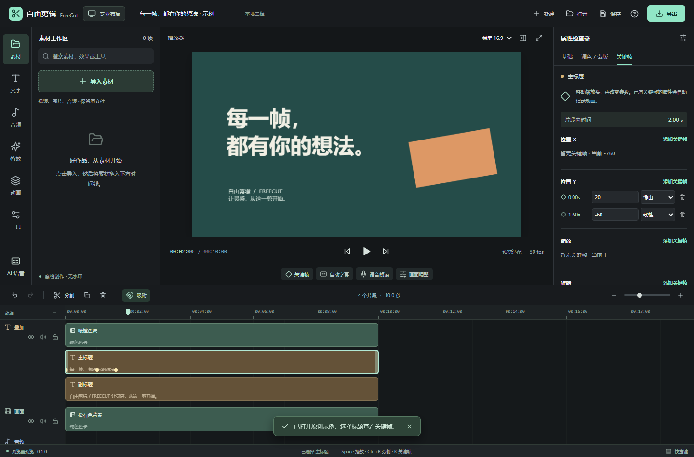
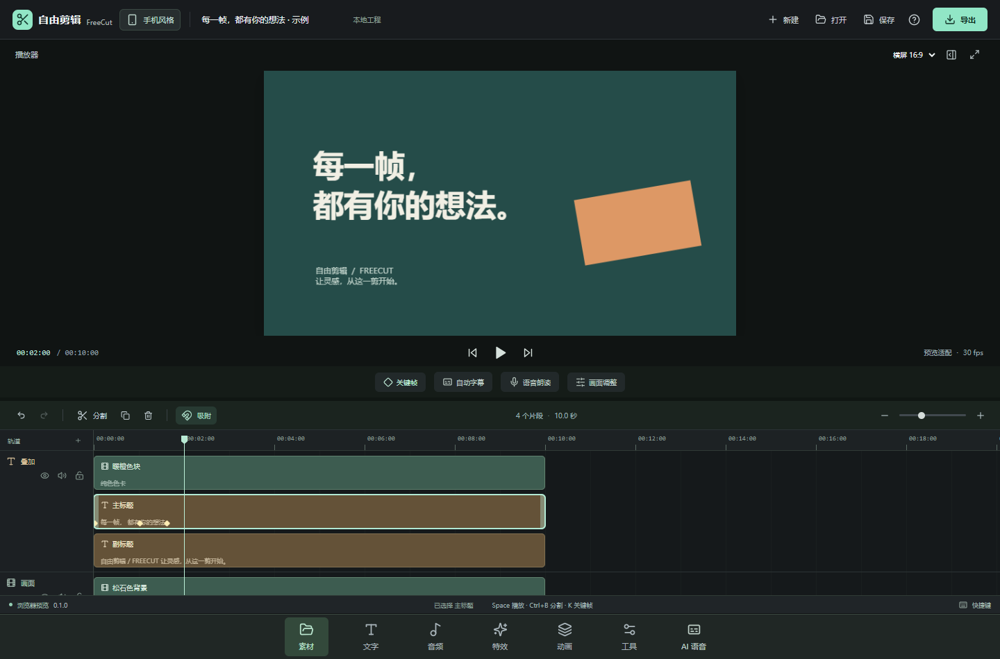

# 自由剪辑 FreeCut

中文、离线优先、无账户、无水印的开源桌面视频编辑器。支持 Windows 和 macOS，面向日常剪辑、电脑端关键帧和容易找到的字幕 / 语音工具。

**当前是 0.1.0 开发预览版，并未完整覆盖剪映。** 本项目独立实现，不包含剪映代码、付费素材或商标资产。已完成和待完成能力请看 [功能矩阵](docs/FEATURE-MATRIX.md)。

实际测试范围见 [验证记录](docs/VERIFICATION.md)。





## 可以做什么

- 导入本地视频、图片、音频；多轨编排、叠加画中画、吸附、修剪、分割、复制、撤销 / 重做。
- 为位置 X/Y、缩放、旋转、不透明度、音量添加关键帧，支持线性、缓入、缓出、缓入缓出、保持。分割保留动画变化。
- 添加文字和字幕，编辑字体大小、颜色、底色、描边；导入 / 导出 SRT。
- 内置原创调色 / 模糊 / 像素化 / 暗角 / 镜像预设；圆形、矩形蒙版与绿幕 / 蓝幕色度抠像。
- 常规变速、音量、画面与音频淡入淡出；动画预设生成可继续编辑的关键帧。
- 横屏、竖屏、方形画布；H.264 + AAC 的 MP4 导出，720p / 1080p / 4K，24–60 fps。
- 工程保存与重开，保留源文件引用；素材不复制进工程文件。
- 左上角切换专业布局 / 手机风格，首次启动引导重点介绍切换入口。
- 按需下载开源运行环境和模型：自动识别字幕、中文语音朗读、ChatTTS 自然对话朗读。安装后本地执行，不上传音视频。

## 下载和运行

源码位于 [Watertube-bilibili/freecut-desktop](https://github.com/Watertube-bilibili/freecut-desktop)。[GitHub Actions](https://github.com/Watertube-bilibili/freecut-desktop/actions) 构建 Windows 安装版 / 便携版、Mac Intel / Apple Silicon 的 DMG / ZIP，产物状态以对应工作流结果为准。

- Windows 安装版：`FreeCut-0.1.0-win-x64-Setup.exe`。
- Windows 便携版：`FreeCut-0.1.0-win-x64-Portable.exe`；设置和下载的模型保存在程序旁的 `FreeCutData`，请放在可写文件夹。
- Mac：分别选择 `arm64`（Apple 芯片）或 `x64`（Intel）版本。当前构建未配置正式 Developer ID 签名和 Apple 公证。

语音模型不放入安装包。首次打开“自动字幕 / 语音朗读”，选择模型，再点“一键下载安装”。下载页面会显示大小、许可、进度、取消和重试。详细说明见 [语音模型](docs/AI-MODELS.md)、[ChatTTS](docs/CHAT-TTS.md)。ChatTTS 的模型采用 CC BY-NC 4.0，**仅用于非商业用途**；不能将“代码开源”当成模型无限制商用授权。

## 开发

需要 Node.js 22.12 或更新版本、npm，开发平台为 Windows x64 或 macOS。使用锁文件获取依赖；部分 npm 版本会要求单独运行二进制下载脚本。

```sh
npm ci
node node_modules/electron/install.js
node node_modules/ffmpeg-static/install.js
npm run prepare:ffmpeg
npm run dev:desktop
```

生产界面和测试：

```sh
npm run build
npm test
node scripts/smoke-desktop.cjs
node scripts/regression-editor.cjs
```

`smoke-desktop.cjs` 在真实 Electron 窗口中生成本地测试素材，验证布局切换、导入、关键帧、字幕、工程保存 / 重开与实际 MP4 导出，结果保存在不提交的 `artifacts/smoke/`。它会用自己的文件路径替代测试进程中的文件对话框，不修改用户素材。

`regression-editor.cjs` 使用独立临时用户目录，验证手机检查器关闭、轨道锁定、关键帧片段缩短后保存重开，以及缺失素材类型和长度校验。可直接用 `npm run test:desktop` 完成构建和这两组测试。真实语音测试脚本默认禁止下载；命令与模型验收结果见模型文档。

仅看浏览器界面：`npm run dev`。浏览器模式支持编辑预览；本地模型、完整工程媒体重开和 FFmpeg 视频导出需要桌面版。

本地测试打包：

```sh
npm run package:win
# 在 Mac 上运行
npm run package:mac
```

正式分发的视频引擎需要同时提供对应源码。CI 使用项目内的固定源码构建流程；本地快速开发使用 `ffmpeg-static` 的供应商预编译包，二者来源不能混淆。见 [第三方声明](THIRD_PARTY_NOTICES.md) 与构建脚本。

## 已知边界

- 这是桌面应用。手机风格是桌面内的交互布局，不是 Android / iOS 安装包。
- 当前逐帧 Canvas 合成和 FFmpeg 编码以正确性优先，长片 / 4K 会耗费时间与临时磁盘；尚无代理媒体和 GPU 渲染管线。
- 浏览器预览解码能力受 Electron 支持的媒体格式约束。常见 MP4 / H.264、PNG / JPEG、WAV / MP3 更适合当前版本；专业编码可能需要先转码。
- 语音识别效果取决于语言、录音和模型；字幕输出可编辑，不能保证完全准确。
- 自动字幕、ChatTTS 的下载与推理涉及网络、磁盘和硬件；完成验证的实际范围见各模型文档，Mac 运行效果仍需要对应设备验收。
- 曲线变速、倒放、钢笔蒙版、跟踪、多机位、多时间线、高级智能抠像、视频生成、云协作等尚未完成。

## 架构与授权

React + TypeScript + Electron。预览和视频帧导出共用 Canvas 合成器及关键帧计算；音频由 FFmpeg 按同一工程模型混合。桌面 IPC 隔离渲染进程，媒体只从用户选择或工程明确引用的本地文件授权。设计与模型协议见 [架构文档](docs/ARCHITECTURE.md)。

本项目代码 GPL-3.0-or-later，见 [LICENSE](LICENSE)。每个第三方库、视频引擎、模型都有独立授权，详见 [THIRD_PARTY_NOTICES.md](THIRD_PARTY_NOTICES.md)。
