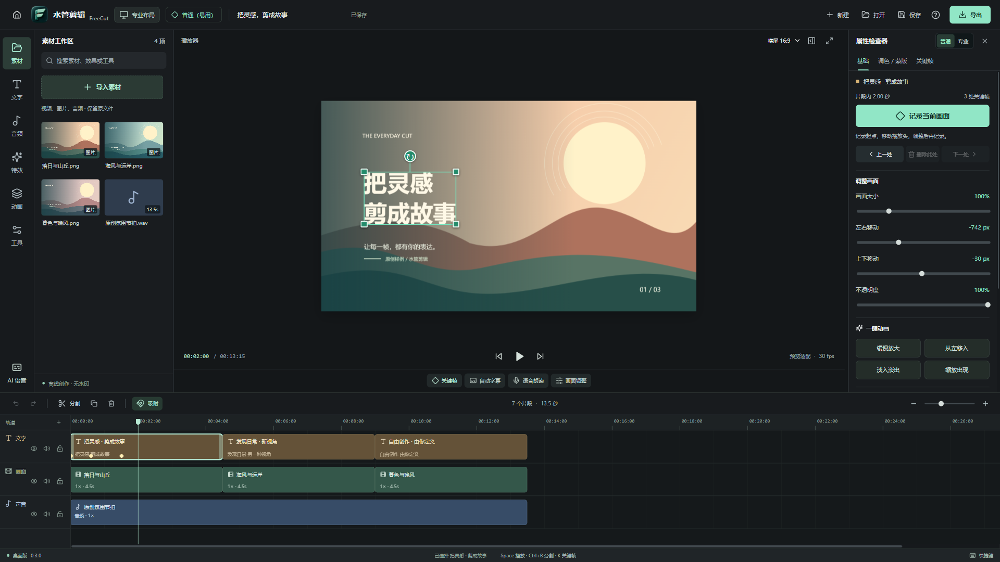
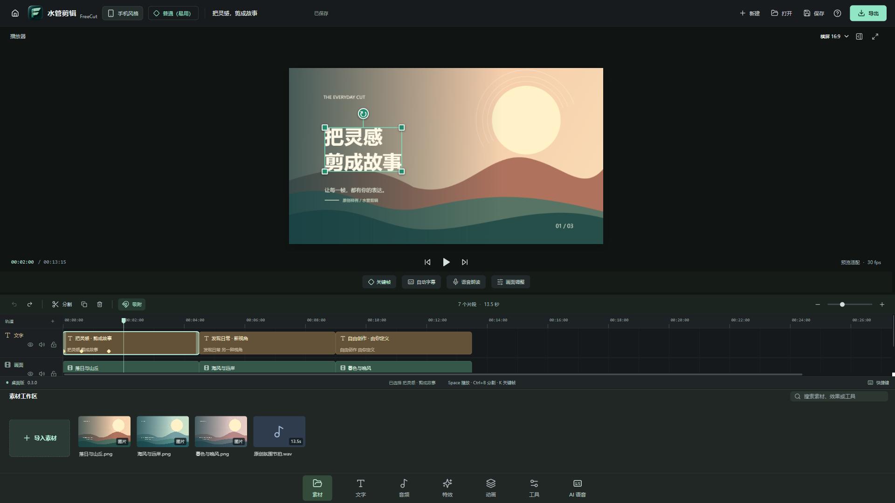

# 水管剪辑 · FreeCut

我叫我水管同学出品。由初中生自主使用 GPT-6 与 Codex 制作的中文开源桌面视频编辑器。支持 Windows 和 macOS，面向日常剪辑、电脑端关键帧和容易找到的字幕 / 语音工具。

**全部功能永久免费，不设会员，不设付费解锁，无水印导出。** 爱发电只是自愿赞助，是否赞助都能使用全部功能。

当前是 0.3.0 开发预览版，并未完整覆盖剪映。无账户要求，媒体在本地处理；更新与可选模型下载需要网络。已完成和待完成能力请看 [功能矩阵](docs/FEATURE-MATRIX.md)。

新版采用原创 3D 图标，以“水管剪辑”为主名称。FreeCut 保留为仓库、安装文件和旧工程的兼容代号。品牌来源与发布前排查见 [品牌说明](docs/BRAND.md) 和 [来源及许可核查](docs/RELEASE-REVIEW-030.md)。

操作步骤见 [中文使用说明](docs/QUICKSTART.md)，实际测试范围见 [验证记录](docs/VERIFICATION.md)。





## 可以做什么

- 导入本地视频、图片、音频；多轨编排、叠加画中画、吸附、修剪、分割、复制、撤销 / 重做。
- 为位置 X/Y、缩放、旋转、不透明度、音量添加关键帧，支持线性、缓入、缓出、缓入缓出、保持。分割保留动画变化。
- 在预览中直接点选、拖动、用角点缩放和旋转；一次拖动对应一次撤销。普通模式一键记录画面，专业模式可继续精确编辑。
- 添加文字和字幕，编辑字体大小、颜色、底色、描边；导入 / 导出 SRT。
- 19 种原创调色预设，另有模糊、像素化、暗角、镜像与绿/蓝幕抠像；7 种几何蒙版，支持位置、旋转、羽化与反转。
- 内置 16 种原创音效，直接试听并加入时间线；支持左右声道音量、平衡、仅左/仅右、单声道和左右交换，预览与导出采用一致路由。
- 常规变速、音量、画面与音频淡入淡出；动画预设生成可继续编辑的关键帧。
- 横屏、竖屏、方形画布；H.264 + AAC 的 MP4 导出，720p / 1080p / 4K，24–60 fps。
- 工程保存与重开，保留源文件引用；素材不复制进工程文件。
- 启动首页：我的项目、搜索与排序、设置、关于；最近工程跨次启动保留，关于页可打开[我的 B站主页](https://space.bilibili.com/390310418?spm_id_from=333.1007.0.0)。
- 未保存时退出、返回首页、新建和打开项目前询问保存；取消保存或保存失败会保留当前工程。
- 普通（易用）关键帧模式，一键记录整组画面、前后跳转、删除和动画预设；专业模式保留精确参数及缓动编辑。
- 预览先完成视频定位和合成，再更新画布；快速拖动时间尺时优先处理最新位置，布局切换保留已显示画面。
- 左上角切换专业布局 / 手机风格，首次启动引导重点介绍切换入口。
- 按需下载开源运行环境和模型：自动识别字幕、中文语音朗读、ChatTTS 自然对话朗读。安装后本地执行，不上传音视频。
- 独立设计的 Windows 安装界面，一键安装到 C 盘、D 盘或自定义目录；自动从本仓库 Release 检查、校验、下载更新，安装前保留未保存工程提示。

## 下载和运行

**[下载 0.3.0 预览版](https://github.com/Watertube-bilibili/freecut-desktop/releases/tag/v0.3.0-preview.1)**：Release 提供 Windows 安装版 / 便携版、Mac Intel / Apple Silicon 的 DMG / ZIP，以及匹配源码、中文教程和 SHA-256 清单。

源码位于 [Watertube-bilibili/freecut-desktop](https://github.com/Watertube-bilibili/freecut-desktop)。每个 Release 的说明列出对应提交与三平台构建记录；发布流程核验应用包、源码和上传文件的散列。

| 你的电脑 / 用途 | 推荐下载 | 说明 |
| --- | --- | --- |
| Windows 10/11 x64，日常使用 | `FreeCut-0.3.0-win-x64-Setup.exe` | 自定义安装页面，首次由你选择磁盘，不预选 C 盘。 |
| Windows 10/11 x64，免安装 | `FreeCut-0.3.0-win-x64-Portable.exe` | 放在可写目录直接运行。程序旁的 `FreeCutData` 保存设置、最近列表与模型，移动时一起保留。 |
| Mac M 系列芯片 | `FreeCut-0.3.0-mac-arm64.dmg` | 打开后拖入 Applications。 |
| Mac Intel 处理器 | `FreeCut-0.3.0-mac-x64.dmg` | 安装方法同上。 |
| Mac 需要 ZIP | 对应芯片的 `mac-arm64.zip` / `mac-x64.zip` | 解压得到同一应用；DMG、ZIP 任选一种。 |

普通使用只需一份应用包，无需下载 `source` 源码包。Mac 可在「 → 关于本机」查看芯片。Windows 未签名；Mac 使用临时签名，尚未配置正式 Developer ID 和 Apple 公证。

从 0.2.0 的旧安装器迁移时，请先通过 Windows 设置卸载旧程序，或为新版选择不同目录。新版不会直接覆盖缺少安装归属清单的旧目录。卸载保留项目和模型数据。Mac 自动更新需先将应用放到可写的 Applications 等目录，不能从只读 DMG 内更新。

语音模型不放入安装包。首次打开“自动字幕 / 语音朗读”，选择模型，再点“一键下载安装”。下载页面会显示大小、许可、进度、取消和重试。详细说明见 [语音模型](docs/AI-MODELS.md)、[ChatTTS](docs/CHAT-TTS.md)。ChatTTS 的模型采用 CC BY-NC 4.0，**仅用于非商业用途**；不能将“代码开源”当成模型无限制商用授权。

## 开发

需要 Node.js 22.12 或更新版本、npm，开发平台为 Windows x64 或 macOS。使用锁文件获取依赖；部分 npm 版本会要求单独运行二进制下载脚本。

```sh
npm ci
node node_modules/electron/install.js
node node_modules/ffmpeg-static/install.js
npm run prepare:ffmpeg
npm run dev:desktop
```

生产界面和测试：

```sh
npm run build
npm test
node scripts/smoke-desktop.cjs
node scripts/regression-editor.cjs
node scripts/regression-preview.cjs
node scripts/regression-home.cjs
node scripts/regression-keyframes.cjs
node scripts/regression-transform.cjs
node scripts/regression-effects.cjs
node scripts/regression-audio.cjs
node scripts/regression-update.cjs
# Windows 自定义安装界面
node installer/smoke.cjs
```

`smoke-desktop.cjs` 在真实 Electron 窗口中生成本地测试素材，验证布局切换、导入、关键帧、字幕、工程保存 / 重开与实际 MP4 导出，结果保存在不提交的 `artifacts/smoke/`。它会用自己的文件路径替代测试进程中的文件对话框，不修改用户素材。

桌面回归覆盖保存退出、真实视频定位、普通关键帧、预览拖拽、蒙版像素、短窗口滚动、立体声预览与导出，以及更新时的保存/取消/失败路径。脚本使用独立临时用户目录；更新回归仅替换网络响应和最后的安装启动器，不改用户安装。`npm run test:desktop` 完成构建和桌面回归。真实语音测试脚本默认禁止下载；命令与模型验收结果见模型文档。

仅看浏览器界面：`npm run dev`。浏览器模式支持编辑预览；本地模型、完整工程媒体重开和 FFmpeg 视频导出需要桌面版。

本地测试打包：

```sh
npm run package:win
# 在 Mac 上运行
npm run package:mac
```

正式分发的视频引擎需要同时提供对应源码。CI 使用项目内的固定源码构建流程；本地快速开发使用 `ffmpeg-static` 的供应商预编译包，二者来源不能混淆。见 [第三方声明](THIRD_PARTY_NOTICES.md) 与构建脚本。

## 已知边界

- 这是桌面应用。手机风格是桌面内的交互布局，不是 Android / iOS 安装包。
- 当前逐帧 Canvas 合成和 FFmpeg 编码以正确性优先，长片 / 4K 会耗费时间与临时磁盘；尚无代理媒体和 GPU 渲染管线。
- 浏览器预览解码能力受 Electron 支持的媒体格式约束。常见 MP4 / H.264、PNG / JPEG、WAV / MP3 更适合当前版本；专业编码可能需要先转码。
- 语音识别效果取决于语言、录音和模型；字幕输出可编辑，不能保证完全准确。
- 自动字幕、ChatTTS 的下载与推理涉及网络、磁盘和硬件；完成验证的实际范围见各模型文档，Mac 运行效果仍需要对应设备验收。
- 曲线变速、倒放、钢笔蒙版、跟踪、多机位、多时间线、高级智能抠像、视频生成、云协作等尚未完成。

## 架构与授权

React + TypeScript + Electron。预览和视频帧导出共用 Canvas 合成器及关键帧计算；音频由 FFmpeg 按同一工程模型混合。桌面 IPC 隔离渲染进程，媒体只从用户选择或工程明确引用的本地文件授权。设计与模型协议见 [架构文档](docs/ARCHITECTURE.md)。

本项目代码 GPL-3.0-or-later，见 [LICENSE](LICENSE)。每个第三方库、视频引擎、模型都有独立授权，详见 [THIRD_PARTY_NOTICES.md](THIRD_PARTY_NOTICES.md)。

欢迎下载体验、提交问题和参与开源。作者：[B站 @我叫我水管同学](https://space.bilibili.com/390310418)。宣传片工程位于 [videos/shuiguan-launch](videos/shuiguan-launch)，爱发电支持入口以作者本人发布的真实链接为准。
