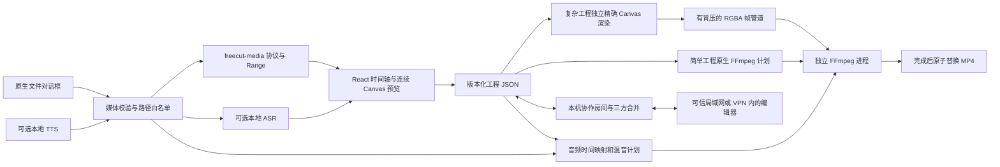

# FreeCut 架构与可追溯构建

FreeCut 0.4.0 是 React/TypeScript 编辑界面、Electron 桌面宿主和独立 FFmpeg 子进程组成的本地视频编辑器。核心工程是版本化 JSON；原始媒体保留在用户选择的位置。连续预览与精确导出使用独立解码状态。简单工程直接由 FFmpeg 处理，复杂画面由 Canvas 合成后通过 RGBA 管道编码；音频由浏览器试听、FFmpeg 混音。可选协作房间由用户自己的电脑承载。具体功能完成度见 [功能矩阵](FEATURE-MATRIX.md)。

## 模块与数据流



| 文件 | 责任 |
| --- | --- |
| `src/types.ts` | 工程、片段、轨道、效果、关键帧与桌面桥接口 |
| `src/core/project.ts` | 默认数据、关键帧求值、裁剪/分割、SRT、前端工程验证 |
| `src/core/renderer.ts` | 连续预览、拖动寻帧调度、独立精确导出、Canvas 合成、播放音频与音量自动化 |
| `src/core/effects.ts` | 原创参数预设；没有下载第三方 shader 包 |
| `src/App.tsx`、`src/components` | 素材库、时间轴、属性、布局、新手引导和导出调度 |
| `electron/preload.cjs` | 白名单式能力桥；不暴露 Node、原始 IPC 或任意路径 IO |
| `electron/main.cjs` | 窗口安全、文件选择、工程读写、任务生命周期与模块注册 |
| `electron/media.cjs` | 探测、实际媒体路径授权、只读自定义协议 |
| `electron/export.cjs` | IPC 参数验证、RGBA／兼容 PNG 管道、音频规划、编码、取消和清理 |
| `electron/ai.cjs` | 可选固定版 sherpa-onnx、ASR/TTS 模型安装和本地推理 |
| `electron/chattts.cjs` | 可选独立 Python/ChatTTS 安装与推理控制器 |
| `electron/native-export.cjs` | 简单工程的原生 FFmpeg 计划；不符合条件时回退 Canvas |
| `src/core/collaboration-session.ts` | 协作版本、草稿三方合并、手势期间延后应用远端内容与冲突处理 |
| `src/collaboration-types.ts`、`src/components/CollaborationPanel.tsx` | 协作桥契约、IP／邀请码连接、成员和冲突处理界面 |
| `electron/collaboration.cjs` | 本机 HTTP 房间、成员与密钥、工程事件、素材流式传输及缓存 |
| `electron/collaboration-protocol.cjs`、`electron/collaboration-merge.mjs` | 网络工程与素材清单验证、限制检查和共享三方合并规则 |
| `installer/main.cjs`、`installer/backend.cjs`、`installer/shortcuts.cjs` | 独立安装界面、目标目录、覆盖安装与回滚、卸载和快捷方式维护 |

## 工程时间与关键帧约定

工程 `version: 1`，包含 `assets`、`tracks` 和 `clips`。时间以秒保存，帧率存于工程。`clip.start` 是时间轴位置，`clip.duration` 是当前时间轴时长，`clip.inPoint` 是源文件入点。正向恒速的源位置为 `inPoint + localTime * speed`。

关键帧时间相对于片段起点；移动片段不改变局部动画。支持 `x/y/scale/rotation/opacity/volume`。位置使用工程像素，缩放与透明度使用倍率，音量 `1` 表示 100%。淡入淡出以秒保存。一个关键帧上的 `easing` 控制该点到下一点的区间；支持线性、二次缓入、二次缓出、分段二次缓入缓出和保持。首点前、末点后保持端点值；同一时刻重复点按最后写入值消歧。

前端的变换计算由纯函数驱动，预览和 Canvas 导出共享。裁剪和分割通过 `sliceAnimation` 补足边界并对截开的缓动区间自适应采样；数值测试覆盖这条路径。音频导出把同一组插值规则转换为 FFmpeg `volume` 表达式，相关回归测试检查关键时刻的结果。曲线变速需要独立时间映射模型，当前不能用常量 `speed` 字段表示。

视觉合成按轨道层次排列，隐藏轨道跳过画面。音频只服从 `muted`，所以隐藏的视频可以继续作为声音来源。这一约定在预览和导出中一致。轨道锁定属于编辑约束，不改变渲染。

## 预览与真实导出

播放预览让视频解码器连续播放，按时间轴采样已解码画面并完成 Canvas 合成，避免每帧反复寻帧。拖动时间条时保留正在解码的一帧，并合并等待中的请求，防止连续取消导致画面始终无法提交；完成后继续追赶最新位置。预览降低画布尺寸并复用合成画布。暂停、跳转与片段切换仍需寻帧，复杂效果仍会消耗 CPU。文字使用当前系统字体，跨系统不保证相同字形。Chromium 不能解码的容器还没有代理回退，FFmpeg 探测成功不能等同所有素材都支持预览。

导出首先复制工程快照并调用 `beginExport` 选择目标。宿主校验尺寸、时长、帧率、ID、引用及数值范围，创建随机临时目录和任务 ID。符合条件的普通视频／图片剪辑使用原生 FFmpeg 计划，跳过浏览器逐帧绘制。文字、视觉关键帧、复杂效果或重叠画面等不符合条件时，使用独立解码状态精确合成每一帧；预览播放不会改变导出寻帧结果。

复杂导出通过 `writeFrame` 将 RGBA 像素流送入已经启动的 FFmpeg stdin，校验连续索引和帧字节数；兼容 PNG 调用也使用管道而非逐帧磁盘文件。每次写入等待背压完成，避免把整部视频缓存到内存，也无需先写完所有帧再开始编码。

宿主按项目生成音频计划：每个源音轨先 `atrim` 并归零 PTS，再分解 `atempo` 因子、重采样到 48 kHz，施加音量曲线、声道设置和淡入淡出，以样本数延迟到片段起点，再用 `amix` 混合。静音轨不参与，静音基底确保无音轨项目也有确定时长。当前混音不包含响度归一化、压缩或降噪处理。

FFmpeg 编码 H.264/AAC MP4，包含 faststart，质量为两个固定 CRF 档位，使用 libx264 veryfast 与有界线程数。复杂滤镜脚本保存到临时文件以避开命令长度和转义问题；兼容旧版 `-filter_complex_script` 与新版 `-/filter_complex`。编码目标是与用户目标文件同目录的随机 staging MP4；编码成功才原子改名。取消终止该任务子进程并清理临时文件，失败保留原有目标文件。目标不能覆盖当前媒体源文件。任务串行执行，没有后台导出队列。

当前管道减少了中间图片的编码和磁盘开销，但不保证复杂特效、长片、4K 或大量图层实时，也没有宣称启用 GPU 编码。代理与 GPU 效果后端仍是后续工作。

## 自托管协作

用户明确开启房间后，本机才监听指定端口（默认 45823）。伙伴通过 IPv4 地址、端口和随机房间密钥加入，也可粘贴包含这些信息的 `freecut1:` 邀请码。协议是未加密的直接 HTTP，适用于可信局域网或可信 VPN；没有公共中继、账号服务器或自动 NAT 穿透，邀请码不能绕过网络可达性要求。

工程按版本发送并进行三方合并：比较共同基线、本地草稿和房间最新版本，不同字段的修改可合并；冲突保留本地内容，由用户选择退出保留本地，或先保存本地副本再采用房间版本。预览和时间条位置各自独立。预览变换、时间轴拖动等手势期间暂缓应用远端工程，松手后再合并，避免手势快照覆盖伙伴的新修改。

网络工程经过字段白名单、引用和数值验证，不接受任意本地路径。共享媒体必须来自本机已授权并属于该工程的素材，按散列与大小验证后流式上传／下载至各参与者的协作缓存，再注册本地媒体 URL；不会开放整个文件系统。离开房间保留本地工程与已下载素材。当前上限为 8 位编辑者、256 个素材、单文件 8 GiB、每房间 32 GiB，并限制并发传输、检查剩余磁盘空间。房间关闭后旧密钥失效；主机需要持续运行。

## 桌面权限与文件边界

窗口启用 `contextIsolation`、sandbox，禁用 `nodeIntegration`；设置 CSP，拒绝非授权导航、新窗口和权限请求。每个宿主 IPC 先检查主窗口 `webContents`、主 frame 和确切页面 URL。浏览器预览不具备桌面桥，导出或模型下载不会伪装成功。

媒体文件只能经用户文件选择或宿主生成后注册。宿主使用真实规范路径、文件类型和文件存在性校验，再发出随机 URL 标识。`freecut-media://asset/<token>` 只读取该注册表中的文件，支持 GET、HEAD 和单范围 Range；URL 不能携带任意系统路径。每次解析媒体源会重新校验实际文件，拒绝无授权路径。

工程打开不是直接信任 JSON 中的 URL：清除旧 token，逐个重新检查真实媒体并注册。缺失文件以缺失资产保留，前端可逐个重连。工程保存使用同目录临时文件、写入并同步、原子改名；不把临时授权 URL 或缩略图写入可移植工程。

FFmpeg 使用参数数组与 `shell: false`。输入协议/容器白名单排除网络及播放列表嵌套输入；公开构建的引擎本身也禁用网络。可选 AI 的固定下载通过受限 HTTPS 下载器完成，与导入媒体读取是不同路径。程序不从用户 PATH 查找 FFmpeg。

## 可选本地语音

基础 ASR/TTS 使用独立 sherpa-onnx 子进程，下载固定版本 N-API 引擎和经过散列验证的模型。SenseVoice 是中文优先模型，Whisper tiny 提供较小的选择，AISHELL-3 提供中文朗读。模型安装只在用户操作后发生；常规剪辑、字幕手工编辑与导出不依赖模型。下载失败、修复、取消及推理错误都有独立状态。

ChatTTS 使用另一套受控 Python/venv，避免修改系统 Python；该提供者有独立状态和取消控制。其官方权重限制非商业使用。基础引擎及模型、中文权重和 ChatTTS 的不同许可不能由应用 GPL 统一覆盖。固定版本、下载体积、磁盘位置和实测情况见 [AI-MODELS.md](AI-MODELS.md)、[CHAT-TTS.md](CHAT-TTS.md)。

Windows 便携版检测 electron-builder 的 `PORTABLE_EXECUTABLE_DIR`，把 Electron `userData` 放入程序旁 `FreeCutData`；模型和生成音频随之保存在该目录。目录不可写会给出错误并退出。普通安装版使用系统应用数据目录。工程引用生成的 WAV；删除模型缓存中的语音文件会导致相应工程素材缺失。

## 开发与源码构建

应用需要 Node.js 22+。安装依赖和构建使用仓库 lockfile：

```sh
npm ci
npm run build
npm run prepare:ffmpeg
npm start
```

没有配置源码引擎时，`prepare:ffmpeg` 使用 `ffmpeg-static` 的本机供应商二进制，保留原始 supplier README、LICENSE、版本信息和精确来源，manifest 标记 `sourceInputsComplete: false`。这条路径用于本地开发验收。它不构成公开分发该供应商所有外部库的完整源码准备。

公开构建使用三份固定源文件：

| 源文件 | 字节数 | SHA-256 |
| --- | ---: | --- |
| `ffmpeg-9.0.1.tar.xz` | 12036420 | `cf38e0e28c7e5605942c4a77755349b0145804a397af37eb1fb4c77cb237f635` |
| `x264-b35605ace3ddf7c1a5d67a2eb553f034aef41d55.tar.gz` | 1040327 | `cd71a7515b0e9a012e1ac9b1f8415bebcaf6fc97d4db32286642ac4c0fbe24f9` |
| `zlib-1.3.1.tar.gz` | 1512791 | `9a93b2b7dfdac77ceba5a558a580e74667dd6fede4585b91eefb60f03b72df23` |

FFmpeg 9.0.1 由 [官方发布页](https://ffmpeg.org/download.html) 确认。x264 固定提交从 VideoLAN 官方 stable ref 独立核对，下载使用同 Git 提交的镜像归档。下载脚本按固定大小与 SHA-256 校验；不会追踪 latest，也不接受浮动 Git 分支。

Windows 在 MSYS2 MINGW64 安装 GCC、NASM、pkgconf、GNU Make、diffutils、tar、xz。Mac 使用本机架构 Xcode Command Line Tools、NASM 和 pkg-config。编译临时目录必须不含空格；仓库路径可以通过 `FREECUT_FFMPEG_BUILD_ROOT` 指定无空格编译目录：

```sh
# Windows: MSYS2 MINGW64
export FREECUT_FFMPEG_BUILD_ROOT=/d/freecut-ffmpeg-build
bash scripts/build-ffmpeg.sh win32-x64

# Mac: 在对应架构机器选择一个
bash scripts/build-ffmpeg.sh darwin-arm64
bash scripts/build-ffmpeg.sh darwin-x64
```

脚本依次编译静态 zlib、静态 x264 和 FFmpeg。FFmpeg 关闭 autodetect、network、ffplay、ffprobe、shared、文档和调试，开启 GPL、version3、libx264、zlib；只有 x264 与 zlib 是额外链接的非系统库。源码无补丁。完整参数、实际配置输出与工具链清单随源码包归档。脚本执行 libx264/AAC 音画烟雾测试，并检查没有网络协议后才生成 manifest。

输出包括 `resources/ffmpeg-source/engine` 和 `artifacts/FreeCut-ffmpeg-source-<target>.tar.gz`。然后在同一平台准备应用资源：

```sh
export FREECUT_FFMPEG_SOURCE_DIR="$PWD/resources/ffmpeg-source/engine"
export FFMPEG_BIN="$FREECUT_FFMPEG_SOURCE_DIR/ffmpeg" # Windows 为 ffmpeg.exe
npm ci
node scripts/prepare-ffmpeg.mjs
npm test
npm run build
```

`FFMPEG_BIN` 让 npm 的开发依赖直接指向已构建引擎，避免 lifecycle 再下载供应商程序。只要 `FREECUT_FFMPEG_SOURCE_DIR` 已设置，资源准备脚本就不会调用 `require('ffmpeg-static')`；它验证平台/架构、二进制散列、外部库清单、许可证、构建记录、匹配源归档的字节数/散列，以及相邻 `archives` 目录中三份源码的字节数/散列后复制资源。源包生成后才把整个包的散列写入外部 manifest，避免让归档自我包含其自身散列。应用运行仅使用该资源目录。

## CI 产物与再分发

`.github/workflows/build.yml` 原生构建 Windows x64、Mac arm64 和 Mac x64。每个任务先编译固定源码引擎，再安装应用依赖、运行测试、编译界面、归档确切应用 Git 提交并打包。Windows 输出带独立自研界面的安装程序和便携 EXE，Mac 输出 DMG 和 ZIP。安装界面及目录选择、覆盖安装由项目自己的 Electron／HTML 界面与安装后端实现；外层启动与解包仍使用 NSIS stub，不是完全移除 NSIS。当前产物为未签名/临时签名预览构建，尚未配置正式签名和公证。

`.github/workflows/publish.yml` 仅手动触发，输入成功的构建编号与预发布标签。脚本校验本仓库 main push、工作流成功、三份平台产物、精确版本文件名、引擎源包散列及三份应用源码解压后内容一致性，附匹配提交的许可与教程并生成 SHA-256 清单。上传草稿全部核验后才公开预发布版本；已公开版本和指向其他提交的 Git 标签拒绝覆盖。首次公开版本为 [v0.1.0-preview.1](https://github.com/Watertube-bilibili/freecut-desktop/releases/tag/v0.1.0-preview.1)。

Actions cache 仅保存最终引擎、原始源归档/lock 和对应源包，不缓存庞大的 `.o` 中间文件。缓存键包括目标平台架构与构建/下载脚本内容散列，没有跨版本回退键。命中时跳过编译工具安装和引擎编译；资源准备时仍重新核验 manifest、二进制与全部源码散列，应用构建、测试和打包也照常执行。未命中时在引擎构建成功后单独保存缓存，因此后面的 UI 测试失败不会丢失有效引擎。

每个 Actions artifact 同时含应用安装包、该平台的 FFmpeg 完整对应源输入归档、确切提交的应用源归档和版本/许可/manifest 文件。源包包含原始压缩源码、固定散列清单、全部构建脚本、完整配置参数与工具链记录，可以脱离项目仓库重建引擎。它不是只列几个上游主页的替代说明。

源码固定，且设置 `SOURCE_DATE_EPOCH`、`ZERO_AR_DATE` 并记录工具链，但 runner 的编译器、系统 SDK 和构建工具未全部永久镜像锁定；因此不声称跨工具链位级相同。Mac 签名可能修改二进制，manifest 中明确记录签名前散列。

Actions artifact 保留 14 天。若将安装包复制到 GitHub Release 或其他下载站，应将对应的两份源归档和声明一起长期保存、提供同等访问，不能让公开二进制仍存在而对应源码过期。完整应用 GPL 文本在 `LICENSE`；依赖声明与源码分发说明在 [THIRD_PARTY_NOTICES.md](../THIRD_PARTY_NOTICES.md)。

## 验证层次

`npm test` 包括前端时间线/关键帧/SRT/工程校验测试和 Electron 宿主 Node 测试。后者覆盖路径和来源验证、媒体范围请求、导出计划、帧序列校验以及真实 FFmpeg 编码/音频采样。真实视频测试需要已准备的引擎；CI 在测试前源码构建并设置了对应路径。

首轮 [CI 运行 34034700514](https://github.com/Watertube-bilibili/freecut-desktop/actions/runs/34034700514) 中，Windows x64、Mac arm64 与 Mac x64 均完成源码引擎、测试、平台安装包和 artifact 上传。Apple 芯片日志确认 41 个前端测试、23 个宿主测试通过，真实 FFmpeg 集成测试没有跳过。

最终 [CI 运行 34037318468](https://github.com/Watertube-bilibili/freecut-desktop/actions/runs/34037318468) 中，三个平台均通过 `scripts/smoke-desktop.cjs`，由 `FREECUT_TEST_EXE` 启动实际打包应用，执行布局切换、真实视频导入、关键帧、中文文字、工程保存重开和 MP4 导出；截图、工程和成片进入 artifact。对应发布源码为 `9a9ac1066134b0ffaebef4dcdc742f048f525f58`。

Windows 语音在实际 Electron 44.2 子进程中已有真实识别与合成记录。Mac 可选模型运行仍需真机检查。不能将 Node 单元测试、构建成功或 Windows 推理成功分别等同于所有操作系统的完整桌面验收。
